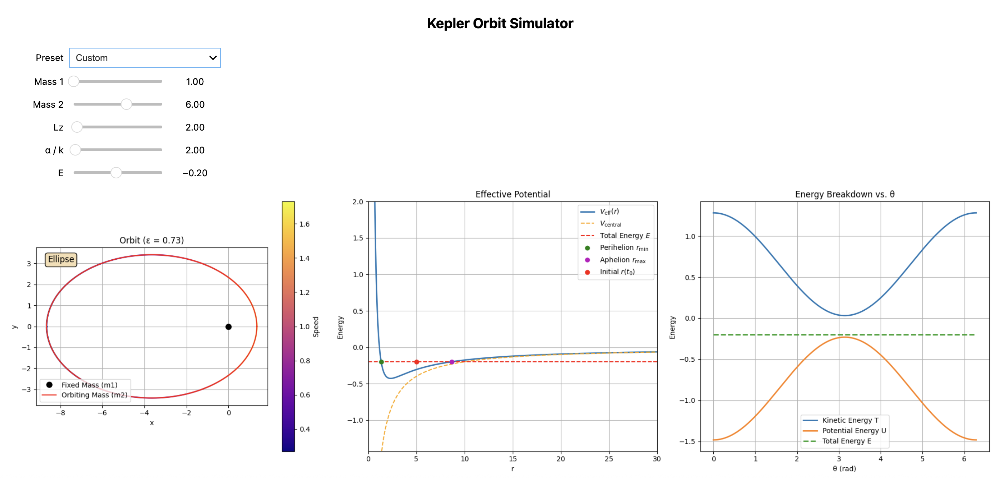
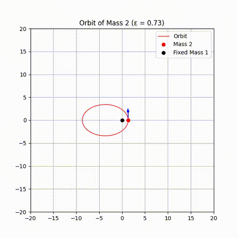

# 🔭 Kepler Orbit & Effective Potential Visualizer

This project visualizes **Keplerian orbits** using two approaches:

1. 📊 A **graph-based interactive tool** showing:
   - Orbital shape (ellipse, parabola, hyperbola)
   - Effective potential
   - Total energy, turning points
2. 🎥 A **classical animation** of a body orbiting around a fixed central mass

---

## 🖼 Preview

### 📊 Interactive Plot (Orbit + Energy)



### 🎥 Animated Orbit



---

## 🚀 Features

- Simulates orbits for:
  - Bound: Ellipses (ε < 1)
  - Unbound: Parabolas (ε = 1), Hyperbolas (ε > 1)
- Displays:
  - Effective potential curve
  - Central potential
  - Total energy line and turning points
- Interactive sliders to vary:
  - Masses
  - Angular momentum
  - Potential strength
  - Total energy

---

## 📦 Requirements

```bash
pip install numpy matplotlib scipy ipywidgets
